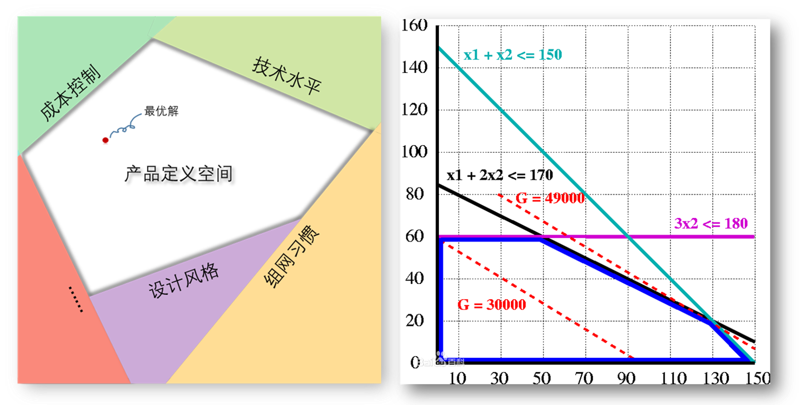
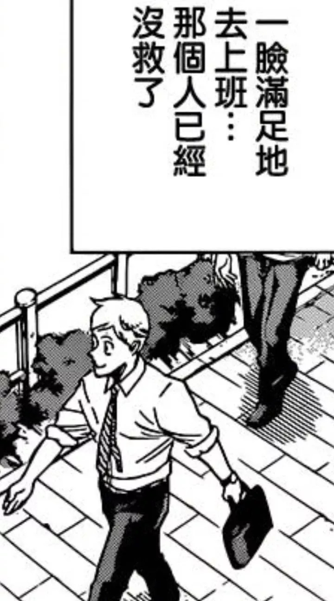

去年大四的时候，终于决定了自己的职业方向：产品经理。

当时明明什么实习经验都没有，硬是靠看书和网上的面经写了一篇「产品」小结出来，为的是梳理一下这个职业的工作内容，好让自己面试时回答得从容一些。

后来也收到了几个offer，阴差阳错，来了TP-LINK成了名硬件产品。现在工作了四个月，也终于转正了，我想也应该写点什么来整理自己收获和吐槽。

### 一、产品定义的新认识

很多人都知道，公司做什么产品，产品要做成什么样，这些都是由产品部来定义的，但是具体的定义过程却很少有人去提，或者只说上一两句「需求分析」和「调研」就把整个定义过程包揽进去了。

产品经理不是艺术家，我们不会去玩弄设计元素，然后根据我们的心意勾勒出一个作品，相对地，产品经理会考虑用户需求、成本、技术难度、公司一脉相承的设计风格等一系列乱七八糟的问题。

你想要个又安静（没有风扇散热），整机功率又大的一体机？不好意思，电池技术做不到；

你想要让这个路由器支持SD-VPN？不好意思，内存不够，得加钱，成本接受吗？

……

有很多因素对产品部说NO、NO、NO，有些问题是可以努力去解决的，有些问题无法解决或者不应该解决，比如你为了不能某个“高级”产品设计，让产品违背用户的使用习惯。

就这样，各种因素划定了一条条产品定义的边界，各条边界组成了对一个产品可以自由定义的狭小的空间，只有在这个空间内定义的产品才是合格的产品。

某种程度上来说，定义一个产品就像解一道线性规划题，只不过我们要自己去找齐限制条件，然后思考产品设计的逻辑与最终产品需求间的关系，才能找到产品定义的最优解。

令人尴尬的是，这个产品定义空间不会剧烈地变化，公司技术团队的水平不会一下子提高，用户组网的习惯也很少变化，以往成熟的产品往往还是这个区域内的较优解，所以，往往费尽心神去想新的解法，还不如一切都沿用以往设计习惯就好。

于是一份份与过去雷同的产品设计输出表出炉，大家默契地想着「不要给自己找事」，只要你沿用以往的设计，没有人会关心说这个产品设计合不合理，好不好用，事实上，我们也没有合理方法去判断一份新答案是否正确。

我想，从公司的角度来说这是合理的，我们有太多的项目要做，既然之前的设计已经在市场上取得了成功，那再费时费钱去精耕细作显然不划算。

但有时候我也想，产品的定义空间总是在不断地动态变化，会不会有一天蓦然回首，发现旧日的设计已经过时，而我、我的领导，其实没有在新的产品定义空间中找到最优解的能力？

### 二、行业知识的积累

在工作中我积累了一些行业的知识，包括各种路由功能原理、硬件知识、设计原则，这些知识的价值在于：①帮助我快速摸清上述的产品定义空间，更快地找到产品设计的要点，②和技术部门达成有效的沟通。

比如说，因为了解BT供电标准（一种大功率以太网供电协议）、市面上的大功率下联设备（通常为2.5G室外AP），所以在我设计2.5G的一体机时，我会考虑硬件上是否有余量可以升级一下供电标准。

比如说，PSE芯片支持的供电口通常为4的倍数，所以遇到10端口产品时应该考虑8口供电，固化2个WAN口（因为WAN口几乎不会下联设备），而非把所有端口都设为自定义。

……

我觉得学习这么一些新东西算是工作中少有的乐趣之一了吧，会感觉到自己的脑筋在动。

同时，这些知识不像是上学时那样从课本上就能习得，至少现在我还没有发现有人去整理这些知识，装订成册。

我只有在遇到相关设计/问题时，出现疑惑，然后和研发交流，才最终了解如此这般，如此那般。这样的学习方式是我以前很少遇到的，也算是种人生新的体验。

不过有时也会感叹，如果以后不在这个行业了，这些知识还会对我有帮助吗？

### 三、日常业务流程

业务流程指一个产品从开始调研到最终上市所需经历的全过程，如果产品经理要控制项目进度的话，我想那他一定要：

了解各个阶段的合理开销（时间、费用），

了解哪个流程可以先跳过以后补做，

了解哪个流程可以通过如此这般，如此那般来加快进度

……

但公司整个流程体系有时候真的让我觉得太烂了。

某一步需要某人花2分钟审核点个【确定】，但是因为对方太忙硬生生拖了三天；

因为资源匮乏，不同项目需要定优先级来穿插进行，但是只能得到一句「找他们领导解决」的回复，然后对方领导也很无奈，最后拖到某个项目完成了，问题消失。

各种办公信息被分割在一个个独立的系统里，各种任务没有一个明确的优先级……

美其名曰【项目管理】，但其实很多时候是在盯着OA系统、DMS系统、这个系统、那个系统上的流程，然后打电话逐一催人。

在紧急项目多的时候，真的会觉得自己被【打电话催人】这件事淹没。

### 四、其他吐槽

进入职场后，觉得比较难受的点是时刻会有种「身不由己」和「被裹挟」的感觉。

那部门聚餐喝酒的事情来说，虽然领导嘴上说着不劝酒，但是领导提议举杯的时候你很难说出那句

「不好意思，我不想喝酒」

其他同事一一给领导敬酒，还是只能从跟着陪上一杯，一场宴席下来，也是满身讨厌的酒气。

有时候我想，我是不是应该无视他们，就直接地说「我不喜欢」

但更多时候，我只是个平凡人，我需要领导的「不讨厌」，需要拿这份工资。

氛围从酒桌蔓延到职场，表演式的加班、缺乏依据的需求……

不过还好，至少它付给了我演出的费用。

